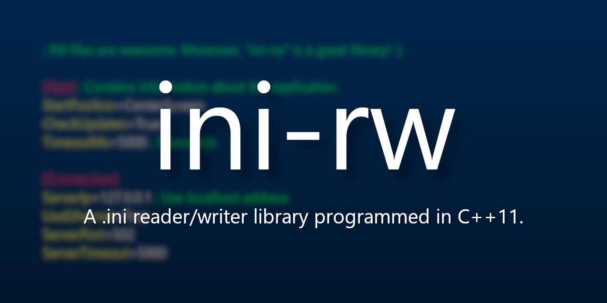

# ini-rw




## Features

* Ability to open `.ini` files for either:
    * Reading
    * Writing
* Ability to save changes to a `.ini` file if modified
* Inline comment support for `.ini` sections and keys

## Example

```cpp
#include "IniSetting.hpp"
#include <iostream>
#include <string>

int main()
{
    inirw::IniSetting iniSettings("path_to_ini_file");

    if (iniSettings) // You could also use iniSettings.is_loaded() instead
    {
        inirw::IniKey* iniKey = iniSettings.get_key("section_name", "key_name");

        if (iniKey)
        {
            std::cout << "INI key information:\n";
            std::cout << "====================\n";
            std::cout << "Section: " << iniKey->get_section()->get_name() << '\n';
            std::cout << "Value: " << iniKey->ValueCommentPair.get_value_before_comment() << '\n';
            std::cout << "Comment: " << iniKey->ValueCommentPair.get_comment() << '\n' << '\n';
        }
        else
        {
            std::cout << "The INI key was not found.\n";
        }

        iniSettings.write_key_value("App", "library_name", "ini-rw");

        // Insert a pound symbol comment at the top of the loaded INI file
        iniSettings.insert_comment(IniCommentPrefix::Pound, "Hello, World!");

        if (iniSettings.save_changes())
        {
            std::cout << "The INI file was saved succesfully!\n";
        }
    }
    else
    {
        std::cout << "Unable to open the INI file.\n";
    }
}
```
